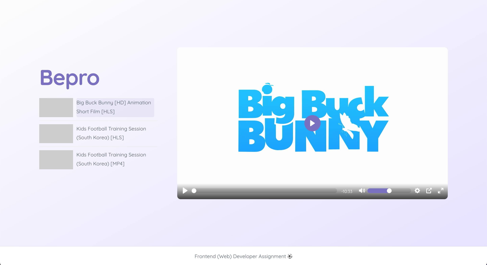

# Video Player

Welcome to my custom video player!

## Overrview

The main goal of this was to develop a video player using React, supporting HLS format, and enabling sequential playback of multiple videos.

## Getting Started

To set up and run the project locally, follow these steps:

1. Install dependencies:
    ```bash
    npm i
    ```

2. Run the project:
    ```bash
    npm run dev
    ```

3. Open [http://localhost:3000](http://localhost:3000) with your browser to see the result.

To run the tests, execute:

1. Run tests:
    ```bash
    npm run test
    ```

## Details

- Use React
- Support HLS format
    - Use hls.js
- Should be able to play multiple videos sequentially
    - Need to show playlist - Display file names only instead of showing full URLs.
- Show loading indicator based on the state of the video player
- Implement a custom control bar which contains
    - Play / pause button
    - Progress bar with seeking feature
    - Change quality (only for HLS videos with multiple resolutions) Change volume
    - Fullscreen toggle
    - Add any features to improve usability (optional)

## Note

If you require any further clarification or additional information regarding the code, please do not hesitate to contact me.


